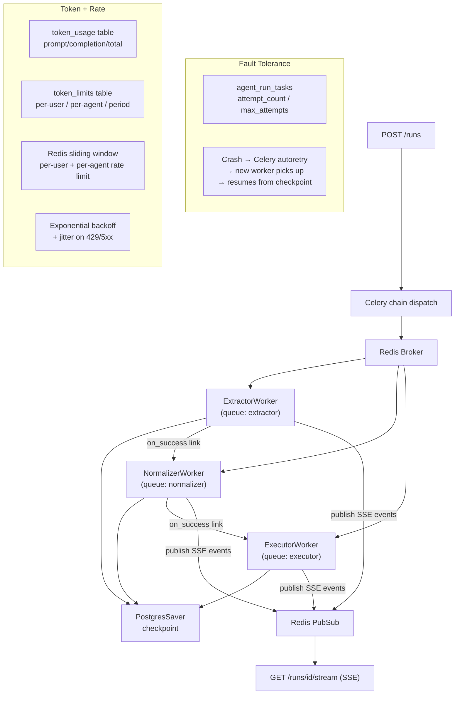

# LangGraph Fault-Tolerant Agents with Celery + Postgres Checkpointer

## Architecture




## New Files

- `**worker/celery_app.py**` — Celery app pointed at `REDIS_URL`, separate queues `extractor`, `normalizer`, `executor`
- `**worker/tasks.py**` — Three `@celery_app.task(bind=True)` tasks; each checks `attempt_count` in DB before running, increments it, runs the LangGraph graph with `PostgresSaver`, publishes SSE events to Redis PubSub, then links to the next task on success
- `**worker/checkpointer.py**` — `get_checkpointer(thread_id)` factory: sync `psycopg` connection → `PostgresSaver.setup()` once; thread_id convention: `{run_id}:{agent_type}` (stable across retries so LangGraph always resumes from last node)
- `**worker/rate_limiter.py**` — `RedisRateLimiter` using sorted-set sliding window (`ZADD` / `ZREMRANGEBYSCORE` / `ZCARD`); per-user key `ratelimit:user:{id}` and per-agent-provider key `ratelimit:agent:{type}:{provider}`; `backoff_jitter(attempt, base=1.0, cap=60.0)` = `random.uniform(0, min(cap, base * 2^attempt))`
- `**worker/token_tracker.py**` — `TokenTrackingCallback(BaseCallbackHandler)` captures `on_llm_end` token counts; `check_token_limit(user_id, agent_type, db)` queries sum of `token_usage` for period vs `token_limits`; `persist_token_usage(...)` writes to DB after graph completes

## Modified Files

### `[api/models.py](api/models.py)`

Add three new ORM models:

- `**AgentRunTask**` (`agent_run_tasks`):
  - `run_id` String (FK → `run_request_logs.run_id`)
  - `user_id` UUID (FK → `users.id`)
  - `agent_type` String — `extractor` / `normalizer` / `executor`
  - `celery_task_id` String (nullable)
  - `checkpoint_thread_id` String — `{run_id}:{agent_type}`
  - `status` String — `pending` / `running` / `completed` / `failed` / `permanently_failed`
  - `attempt_count` Integer default 0
  - `max_attempts` Integer default 3 (env-configurable)
  - `error_message` Text (nullable)
- `**TokenUsage**` (`token_usage`):
  - `user_id`, `run_id`, `agent_type`, `provider`, `model`
  - `prompt_tokens`, `completion_tokens`, `total_tokens` Integers
- `**TokenLimit**` (`token_limits`):
  - `user_id` UUID nullable (null = global default)
  - `agent_type` String nullable (null = all agents)
  - `period` String — `daily` / `monthly`
  - `max_tokens` Integer

### `[api/db.py](api/db.py)`

Add `sync_session_factory` using standard `psycopg2` / `sqlalchemy` (non-async) for use in Celery workers which cannot use `asyncpg`.

### `[api/routes/runs.py](api/routes/runs.py)`

- Replace `asyncio.create_task(_run_pipeline_task(...))` with dispatching a Celery chain: `run_extractor_task.signature(...).apply_async(queue="extractor")`
- Create three `AgentRunTask` rows (pending) before dispatching
- Replace `asyncio.Queue`-based SSE with async Redis PubSub subscription on channel `run:{run_id}:events`

### `[src/action_extractor/workflow.py](src/action_extractor/workflow.py)`

Add optional `checkpointer` and `thread_id` params to `create_action_extraction_graph()`:

```python
app = workflow.compile(checkpointer=checkpointer)
# invoke with: app.invoke(state, config={"configurable": {"thread_id": thread_id}})
```

Same changes to `src/action_normalizer/workflow.py` and `src/action_executor/workflow.py`.

### `[requirements.txt](requirements.txt)`

Add: `celery[redis]`, `redis`, `langgraph-checkpoint-postgres`, `psycopg[binary]`, `psycopg2-binary`

### `[docker-compose.yml](docker-compose.yml)`

Add:

- `redis` service (`redis:7-alpine`, port 6379)
- `worker` service: same build, command `celery -A worker.celery_app worker --concurrency=4 -Q extractor,normalizer,executor`; depends on postgres + redis

### `[.env.example](.env.example)`

Add: `REDIS_URL`, `CELERY_MAX_RETRIES` (default 3), `TOKEN_LIMIT_DAILY_DEFAULT`, `RATE_LIMIT_USER_PER_MINUTE`, `RATE_LIMIT_AGENT_PER_MINUTE`

## Retry Flow

```
Worker A crashes mid-extractor
  → Celery autoretry triggers
  → Worker B picks up task
  → Loads AgentRunTask row: attempt_count < max_attempts → OK
  → Increments attempt_count
  → PostgresSaver finds checkpoint for thread_id "{run_id}:extractor"
  → LangGraph resumes from last completed node (not from scratch)
  → If Worker B also crashes: attempt_count hits max_attempts → status = permanently_failed → no more retries
```

## Rate Limit + Backoff Flow

```
Before each LLM call:
  1. RedisRateLimiter.check("user:{id}", limit, window) → wait or raise
  2. RedisRateLimiter.check("agent:{type}:{provider}", limit, window) → wait or raise
On provider 429/503:
  3. Catch error, compute backoff_jitter(attempt) seconds, sleep, re-raise for Celery retry
```

