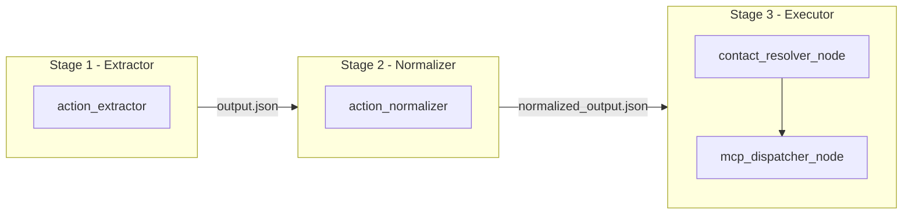

# Relation Graph + Action Executor Plan

## What the problem is

Current `tool_params` in `[output/normalized_output.json](output/normalized_output.json)` contain raw/incomplete contact info extracted from transcript text:

- `send_email` → `"to": "John"` (no address; should be client's email)
- `set_calendar` → `"participants": []` (missing Ash + Kajan from dev team)
- `send_notification` → `"recipient": "the"` or `null` (missing Slack channel / email for finance dept, security team)

The **relation graph** is the lookup table that fills these gaps. The **action executor** is the pipeline stage that uses it, then calls the actual tools via MCP.

---

## New Pipeline Stage




---

## 1. Relation Graph — `src/relation_graph/`

### `contacts.json` (data file, user-editable)

Defines every person, their own contact details, and named connections (groups/external parties):

```json
{
  "people": {
    "Priya": {
      "email": "priya@company.com",
      "slack_handle": "@priya",
      "notion_workspace": "company-workspace",
      "connections": {
        "security_team": { "slack_channel": "#security", "email": "security@company.com" }
      }
    },
    "John": {
      "email": "john466@gmail.com",
      "slack_handle": "@john",
      "connections": {
        "finance": { "email": "finance.companyname@gmail.com", "slack_channel": "#finance" },
        "dev_team": {
          "members": [
            { "name": "Ash",   "email": "ash.who@gmail.com" },
            { "name": "Kajan", "email": "kazz@gmail.com"    }
          ]
        },
        "client_delta": { "email": "client-delta@external.com" }
      }
    },
    "Mike":  { "email": "mike@company.com", "slack_handle": "@mike", "jira_user": "mike" },
    "Sara":  { "email": "sara@company.com", "slack_handle": "@sara", "notion_workspace": "company-workspace" }
  }
}
```

### `models.py`

Pydantic models: `ContactInfo`, `Connection`, `Person`, `RelationGraph`.

### `resolver.py`

`ContactResolver` class — loaded once, exposes:

- `resolve_email(name)` — person's own email or a named connection email
- `resolve_slack(name, connection_key)` — Slack handle or channel
- `resolve_participants(assignee, context_tags)` — returns list of `{name, email}` by matching topic tags (e.g. `"bug bash"` → dev_team of the assignee)
- `enrich_tool_params(action: NormalizedAction) → dict` — main entry point; patches each tool's params:


| ToolType            | Fields enriched                                  |
| ------------------- | ------------------------------------------------ |
| `send_email`        | `to` → resolved email address                    |
| `set_calendar`      | `participants` → member list from relation graph |
| `send_notification` | `recipient` → Slack handle/channel or email      |
| `create_jira_task`  | `assignee` → Jira username                       |
| `create_notion_doc` | `workspace` → Notion workspace id                |


---

## 2. Action Executor — `src/action_executor/`

### `state.py`

```python
class ExecutorState(TypedDict, total=False):
    normalized_actions: List[dict]       # from normalizer output
    enriched_actions:   List[dict]       # after contact resolution
    results:            List[dict]       # execution results per action
```

### `nodes.py`

Two nodes:

`**contact_resolver_node**`

- Loads `ContactResolver` from `src/relation_graph/resolver.py`
- Iterates each `NormalizedAction`, calls `enrich_tool_params()`, writes to `enriched_actions`

`**mcp_dispatcher_node**`

- For each enriched action, looks up `ToolType → MCP server + tool name` from `mcp_config.json`
- Calls the MCP tool via `langchain-mcp-adapters` (see MCP section below)
- Appends result (success/failure, response payload) to `results`

### `workflow.py`

Two-node LangGraph: `contact_resolver_node → mcp_dispatcher_node`

---

## 3. MCP Integration

**Yes — MCP servers are the right execution layer here.** Each `ToolType` maps to an official MCP server:


| ToolType            | MCP Server                           |
| ------------------- | ------------------------------------ |
| `send_email`        | `@googleapis/mcp-server-gmail`       |
| `set_calendar`      | `@googleapis/mcp-server-calendar`    |
| `send_notification` | `@modelcontextprotocol/server-slack` |
| `create_notion_doc` | `@notionhq/notion-mcp-server`        |
| `create_jira_task`  | community Jira MCP server            |


**Integration method:** `langchain-mcp-adapters` (new dep) wraps any MCP server's tools as callable LangChain tools — fits naturally in this LangGraph project.

### `mcp_config.json` (project root)

```json
{
  "mcpServers": {
    "gmail":    { "command": "npx", "args": ["-y", "@googleapis/mcp-server-gmail"] },
    "calendar": { "command": "npx", "args": ["-y", "@googleapis/mcp-server-calendar"] },
    "slack":    { "command": "npx", "args": ["-y", "@modelcontextprotocol/server-slack"],
                  "env": { "SLACK_BOT_TOKEN": "${SLACK_BOT_TOKEN}" } },
    "notion":   { "command": "npx", "args": ["-y", "@notionhq/notion-mcp-server"],
                  "env": { "NOTION_API_TOKEN": "${NOTION_API_TOKEN}" } },
    "jira":     { "command": "npx", "args": ["-y", "jira-mcp-server"] }
  }
}
```

`**mcp_clients.py**` — `MCPDispatcher` class that:

1. Reads `mcp_config.json`
2. On startup, launches MCP server processes via `MultiServerMCPClient` from `langchain-mcp-adapters`
3. Exposes `dispatch(tool_type, tool_params) → result`

---

## 4. New Files Summary

- `src/relation_graph/contacts.json` — editable contact data
- `src/relation_graph/models.py` — Pydantic models
- `src/relation_graph/resolver.py` — `ContactResolver`
- `src/relation_graph/__init__.py`
- `src/action_executor/state.py`
- `src/action_executor/nodes.py`
- `src/action_executor/workflow.py`
- `src/action_executor/mcp_clients.py`
- `src/action_executor/__init__.py`
- `mcp_config.json` — MCP server definitions
- `run_executor.py` — CLI entry point
- Update `requirements.txt` → add `mcp`, `langchain-mcp-adapters`
- Update `.env.example` → add `SLACK_BOT_TOKEN`, `NOTION_API_TOKEN`, etc.

---

## 5. Enrichment Examples (Before → After)

**Bug bash calendar** (`285bc753`):

- Before: `"participants": []`
- After: `"participants": [{"name": "Ash", "email": "ash.who@gmail.com"}, {"name": "Kajan", "email": "kazz@gmail.com"}]`
- Resolution logic: assignee=John + topic_tag `"bug bash"` → John's `dev_team` connection

**Finance notification** (`966e958a`):

- Before: `"recipient": "the"`
- After: `"recipient": "finance.companyname@gmail.com"`, `"channel": "#finance"`
- Resolution logic: assignee=John + topic_tag `"finance"` → John's `finance` connection

**Security slack** (`122f5ef0`):

- Before: `"recipient": null`
- After: `"recipient": "#security"`
- Resolution logic: assignee=Priya + topic_tag `"security"` → Priya's `security_team` connection

