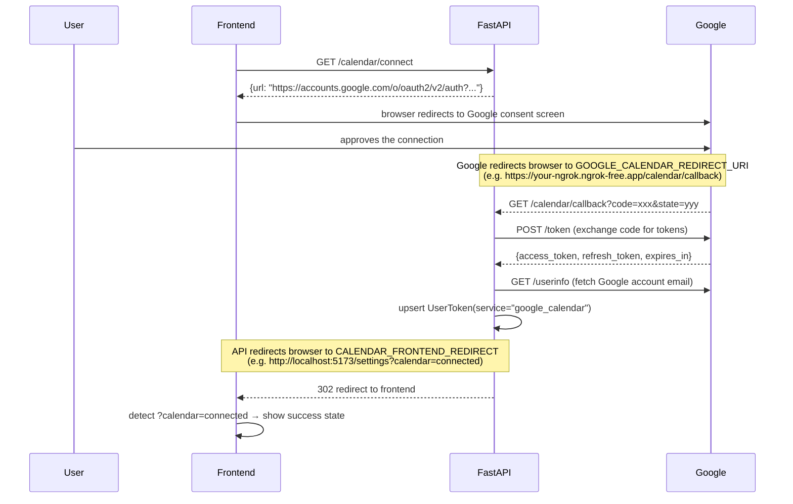

# Google Calendar Integration API

Allows users to connect their Google Calendar account via OAuth 2.0. Once connected, their access token and refresh token are stored securely and can be used by the pipeline to create and manage calendar events.

**Base URL (local):** `http://localhost:8000`  
**Interactive docs:** `http://localhost:8000/docs`

---

## Endpoints

| Method | Path | Auth required | Description |
|--------|------|:---:|-------------|
| `GET` | `/calendar/connect` | Yes | Get the Google OAuth authorization URL to redirect the user to |
| `GET` | `/calendar/callback` | No | Google redirects here after the user approves — exchanges code for tokens and stores them |
| `GET` | `/calendar/status` | Yes | Check whether the current user has connected Google Calendar |
| `DELETE` | `/calendar/disconnect` | Yes | Remove the user's stored Google Calendar tokens |

All protected routes accept the JWT via **`Authorization: Bearer <token>`**.

---

## OAuth Flow

```
1. Frontend calls GET /calendar/connect → gets a URL
2. Frontend redirects the user to that URL (Google's consent screen)
3. User approves → Google redirects to GET /calendar/callback (your backend)
4. Backend exchanges the code for access + refresh tokens, stores them, redirects user to CALENDAR_FRONTEND_REDIRECT
5. Frontend detects ?calendar=connected and shows a success state
```



---

## Setup

### 1. Create a Google Cloud project and enable the Calendar API

1. Go to [Google Cloud Console](https://console.cloud.google.com/)
2. Create a new project (or select an existing one)
3. Navigate to **APIs & Services → Library** and enable **Google Calendar API**

### 2. Create OAuth 2.0 credentials

1. Go to **APIs & Services → Credentials → Create Credentials → OAuth client ID**
2. Select **Web application** as the application type
3. Under **Authorised redirect URIs**, add your callback URL:
   - Local dev (via ngrok): `https://your-static-name.ngrok-free.app/calendar/callback`
   - Production: `https://yourdomain.com/calendar/callback`
4. Copy the **Client ID** and **Client Secret**

### 3. Configure the OAuth consent screen

1. Go to **APIs & Services → OAuth consent screen**
2. Set the app name, support email, and developer contact
3. Add the scope `https://www.googleapis.com/auth/calendar`
4. While in testing, add your Google account as a test user

### 4. Set environment variables

Copy `.env.example` to `.env` and fill in:

```env
GOOGLE_CLIENT_ID=your-google-oauth-client-id-here
GOOGLE_CLIENT_SECRET=your-google-oauth-client-secret-here
GOOGLE_CALENDAR_REDIRECT_URI=https://your-ngrok-url.ngrok-free.app/calendar/callback
CALENDAR_FRONTEND_REDIRECT=http://localhost:5173/settings?calendar=connected
```

> **Note:** `GOOGLE_CLIENT_ID` / `GOOGLE_CLIENT_SECRET` here are for the **user-facing OAuth flow** (so users can connect their own calendars). These are different from `GOOGLE_API_KEY` which is used by the LLM pipeline.

---

## GET /calendar/connect

Returns the Google OAuth authorization URL. The frontend should redirect the user (or open a popup) to this URL.

### Request

**Authentication:** required. Send JWT via `Authorization: Bearer <token>`.

No request body or query parameters.

### Response

**Status:** `200 OK`

```json
{
  "url": "https://accounts.google.com/o/oauth2/v2/auth?client_id=...&scope=openid+email+...&access_type=offline&prompt=consent&state=..."
}
```

The URL includes `access_type=offline` and `prompt=consent` to ensure a `refresh_token` is always returned by Google.

### Example (fetch)

```js
const res = await fetch('http://localhost:8000/calendar/connect', {
  headers: { Authorization: `Bearer ${jwt}` },
});
const { url } = await res.json();
window.location.href = url;   // or open in a popup
```

---

## GET /calendar/callback

> **Note:** This endpoint is called by Google directly — not by your frontend code. You only need to be aware of it so you can handle the redirect it sends back to your frontend.

Google sends the browser here after the user approves the connection. The API:

1. Validates the `state` parameter to identify the user.
2. Exchanges the `code` for an `access_token` and `refresh_token` via Google's token endpoint.
3. Fetches the user's Google account email from `/oauth2/v2/userinfo`.
4. Saves the tokens to the database (`UserToken` with `service="google_calendar"`), including `expires_at`.
5. Redirects the browser to `CALENDAR_FRONTEND_REDIRECT` (configured on the server).

### Query Parameters (sent by Google)

| Parameter | Description |
|-----------|-------------|
| `code` | Temporary authorization code from Google |
| `state` | Opaque state token issued by `/calendar/connect` |

### Frontend handling

After the redirect, detect the result from the URL query string:

```js
// e.g. on /settings page mount
const params = new URLSearchParams(window.location.search);

if (params.get('calendar') === 'connected') {
  // show success toast / refresh status
}
```

### Error responses

| Status | When |
|--------|------|
| `400` | Invalid `state` parameter or Google returned an OAuth error |
| `502` | Could not reach Google's token endpoint |
| `503` | `GOOGLE_CLIENT_ID` / `GOOGLE_CLIENT_SECRET` not configured on the server |

---

## GET /calendar/status

Check whether the current user has a connected Google Calendar account.

### Request

**Authentication:** required. Send JWT via `Authorization: Bearer <token>`.

### Response

**Status:** `200 OK`

```json
{
  "connected": true,
  "email": "user@gmail.com",
  "scopes": "openid email https://www.googleapis.com/auth/calendar"
}
```

| Field | Type | Description |
|-------|------|-------------|
| `connected` | boolean | `true` if a Google Calendar token exists for this user |
| `email` | string \| null | The Google account email used to connect, or `null` if not connected |
| `scopes` | string \| null | Space-separated list of granted OAuth scopes, or `null` if not connected |

### Example (fetch)

```js
const res = await fetch('http://localhost:8000/calendar/status', {
  headers: { Authorization: `Bearer ${jwt}` },
});
const status = await res.json();

if (status.connected) {
  console.log(`Connected as ${status.email}`);
} else {
  console.log('Google Calendar not connected');
}
```

---

## DELETE /calendar/disconnect

Remove the user's stored Google Calendar tokens. Idempotent — returns `204` whether or not a token existed.

### Request

**Authentication:** required. Send JWT via `Authorization: Bearer <token>`.

No request body.

### Response

**Status:** `204 No Content`

### Example (fetch)

```js
await fetch('http://localhost:8000/calendar/disconnect', {
  method: 'DELETE',
  headers: { Authorization: `Bearer ${jwt}` },
});
// Tokens removed — update UI to show disconnected state
```

---

## Suggested UI Flow (Settings Page)

```
┌─────────────────────────────────────────┐
│  Integrations                           │
│                                         │
│  Google Calendar                        │
│  ┌─────────────────────────────────┐    │
│  │ ● Connected — user@gmail.com   │    │
│  │                    [Disconnect] │    │
│  └─────────────────────────────────┘    │
│                                         │
│  — or when not connected —              │
│  ┌─────────────────────────────────┐    │
│  │  Google Calendar not connected  │    │
│  │          [Connect Google Calendar]   │
│  └─────────────────────────────────┘    │
└─────────────────────────────────────────┘
```

1. On page load, call `GET /calendar/status` to check connection state.
2. **Connect button** → call `GET /calendar/connect`, redirect user to the returned URL.
3. On return (`?calendar=connected` in URL), re-fetch status and show success.
4. **Disconnect button** → call `DELETE /calendar/disconnect`, re-fetch status.

---

## Token Storage

Tokens are stored in the `user_tokens` table under `service="google_calendar"`:

| Column | Value |
|--------|-------|
| `access_token` | Short-lived Google access token |
| `refresh_token` | Long-lived token used to obtain new access tokens (persisted on first connect) |
| `expires_at` | UTC timestamp when the access token expires (typically 1 hour from issue) |
| `meta.email` | Google account email address |
| `meta.scopes` | Space-separated granted scopes |

> **Refresh token note:** Google only returns a `refresh_token` on the first authorization or when `prompt=consent` is used. The API always requests `prompt=consent` so the refresh token is reliably returned on every connect. On re-connect, the existing refresh token is preserved if Google does not return a new one.

---

## Error Reference

| Status | Meaning |
|--------|---------|
| `204` | Success (disconnect) |
| `302` | Callback redirect to frontend (normal OAuth completion) |
| `400` | Bad request — invalid state or Google OAuth error |
| `401` | Missing or invalid JWT |
| `502` | Could not reach Google's API |
| `503` | Google Calendar OAuth not configured on the server (missing env vars) |
