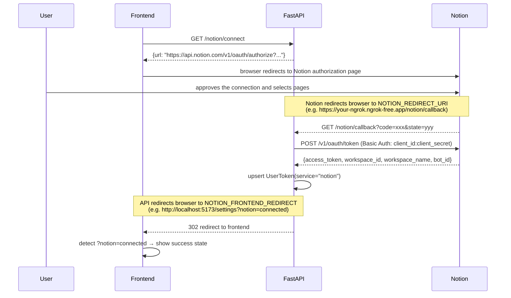

# Notion Integration API

Allows users to connect their Notion workspace via OAuth. Once connected, their Notion access token is stored securely and can be used by the pipeline to create and manage docs as actions.

**Base URL (local):** `http://localhost:8000`  
**Interactive docs:** `http://localhost:8000/docs`

---

## Endpoints

| Method | Path | Auth required | Description |
|--------|------|:---:|-------------|
| `GET` | `/notion/connect` | Yes | Get the Notion OAuth authorization URL to redirect the user to |
| `GET` | `/notion/callback` | No | Notion redirects here after the user approves — exchanges code for token and stores it |
| `GET` | `/notion/status` | Yes | Check whether the current user has connected Notion |
| `DELETE` | `/notion/disconnect` | Yes | Remove the user's stored Notion token |

All protected routes accept the JWT via **`Authorization: Bearer <token>`**.

---

## OAuth Flow

```
1. Frontend calls GET /notion/connect → gets a URL
2. Frontend redirects the user to that URL (Notion's authorization page)
3. User selects pages/workspace to share → Notion redirects to GET /notion/callback (your backend)
4. Backend exchanges the code for a token using HTTP Basic Auth, stores it, redirects user to NOTION_FRONTEND_REDIRECT
5. Frontend detects ?notion=connected and shows a success state
```



> **Note on token exchange:** Unlike Slack, Jira, and Google, Notion's token endpoint requires the client credentials to be sent as an **HTTP Basic Auth** header (`Authorization: Basic base64(client_id:client_secret)`), not in the request body.

> **Note on token expiry:** Notion access tokens do not expire. There is no refresh token.

---

## Setup

1. Go to [https://www.notion.so/my-integrations](https://www.notion.so/my-integrations) and create a new integration.
2. Set the integration type to **Public** (required for OAuth — internal integrations use a static token, not OAuth).
3. Under **OAuth Domain & URIs**, add your `NOTION_REDIRECT_URI` (must be HTTPS; use an ngrok tunnel for local dev).
4. Copy the **OAuth client ID** and **OAuth client secret** from the integration settings.
5. Add to your `.env`:

```env
NOTION_CLIENT_ID=your-notion-oauth-client-id-here
NOTION_CLIENT_SECRET=your-notion-oauth-client-secret-here
NOTION_REDIRECT_URI=https://your-ngrok-url.ngrok-free.app/notion/callback
NOTION_FRONTEND_REDIRECT=http://localhost:5173/settings?notion=connected
```

---

## GET /notion/connect

Returns the Notion OAuth authorization URL. The frontend should redirect the user (or open a popup) to this URL.

### Request

**Authentication:** required. Send JWT via `Authorization: Bearer <token>`.

No request body or query parameters.

### Response

**Status:** `200 OK`

```json
{
  "url": "https://api.notion.com/v1/oauth/authorize?client_id=...&redirect_uri=...&response_type=code&owner=user&state=..."
}
```

### Example (fetch)

```js
const res = await fetch('http://localhost:8000/notion/connect', {
  headers: { Authorization: `Bearer ${jwt}` },
});
const { url } = await res.json();
window.location.href = url;   // or open in a popup
```

---

## GET /notion/callback

> **Note:** This endpoint is called by Notion directly — not by your frontend code. You only need to be aware of it so you can handle the redirect it sends back to your frontend.

Notion sends the browser here after the user approves the connection. The API:

1. Validates the `state` parameter to identify the user.
2. Exchanges the `code` for an access token via Notion's `/v1/oauth/token` endpoint (using HTTP Basic Auth).
3. Saves the token to the database (`UserToken` with `service="notion"`), storing `workspace_id`, `workspace_name`, `workspace_icon`, and `bot_id` in the `meta` field.
4. Redirects the browser to `NOTION_FRONTEND_REDIRECT` (configured on the server, e.g. `http://localhost:5173/settings?notion=connected`).

### Query Parameters (sent by Notion)

| Parameter | Description |
|-----------|-------------|
| `code` | Temporary authorization code from Notion |
| `state` | Opaque state token issued by `/notion/connect` |

### Frontend handling

After the redirect, detect the result from the URL query string:

```js
// e.g. on /settings page mount
const params = new URLSearchParams(window.location.search);

if (params.get('notion') === 'connected') {
  // show success toast / refresh status
}
```

### Error responses

| Status | When |
|--------|------|
| `400` | Invalid `state` parameter or Notion returned an OAuth error (e.g. user cancelled) |
| `502` | Could not reach Notion's token endpoint |
| `503` | `NOTION_CLIENT_ID` / `NOTION_CLIENT_SECRET` not configured on the server |

---

## GET /notion/status

Check whether the current user has a connected Notion workspace.

### Request

**Authentication:** required. Send JWT via `Authorization: Bearer <token>`.

### Response

**Status:** `200 OK`

```json
{
  "connected": true,
  "workspace_name": "Acme Corp",
  "workspace_id": "a1b2c3d4-..."
}
```

| Field | Type | Description |
|-------|------|-------------|
| `connected` | boolean | `true` if a Notion token exists for this user |
| `workspace_name` | string \| null | Name of the connected Notion workspace, or `null` if not connected |
| `workspace_id` | string \| null | The Notion workspace UUID, or `null` if not connected |

### Example (fetch)

```js
const res = await fetch('http://localhost:8000/notion/status', {
  headers: { Authorization: `Bearer ${jwt}` },
});
const status = await res.json();

if (status.connected) {
  console.log(`Connected to "${status.workspace_name}"`);
} else {
  console.log('Not connected');
}
```

---

## DELETE /notion/disconnect

Remove the user's stored Notion token. Idempotent — returns `204` whether or not a token existed.

### Request

**Authentication:** required. Send JWT via `Authorization: Bearer <token>`.

No request body.

### Response

**Status:** `204 No Content`

### Example (fetch)

```js
await fetch('http://localhost:8000/notion/disconnect', {
  method: 'DELETE',
  headers: { Authorization: `Bearer ${jwt}` },
});
// Token removed — update UI to show disconnected state
```

---

## Suggested UI Flow (Settings Page)

```
┌─────────────────────────────────────────┐
│  Integrations                           │
│                                         │
│  Notion                                 │
│  ┌─────────────────────────────────┐    │
│  │ ● Connected — Acme Corp        │    │
│  │ Workspace ID: a1b2c3d4-...      │    │
│  │                   [Disconnect]  │    │
│  └─────────────────────────────────┘    │
│                                         │
│  — or when not connected —              │
│  ┌─────────────────────────────────┐    │
│  │  Notion not connected           │    │
│  │                [Connect Notion] │    │
│  └─────────────────────────────────┘    │
└─────────────────────────────────────────┘
```

1. On page load, call `GET /notion/status` to check connection state.
2. **Connect button** → call `GET /notion/connect`, redirect user to the returned URL.
3. On return (`?notion=connected` in URL), re-fetch status and show success.
4. **Disconnect button** → call `DELETE /notion/disconnect`, re-fetch status.

---

## Stored Token Data

The following fields are saved in `UserToken.meta` after a successful connection:

| Field | Description |
|-------|-------------|
| `workspace_id` | Notion workspace UUID |
| `workspace_name` | Human-readable workspace name |
| `workspace_icon` | Workspace icon URL or emoji (may be `null`) |
| `bot_id` | The bot UUID associated with this integration |

---

## Error Reference

| Status | Meaning |
|--------|---------|
| `204` | Success (disconnect) |
| `302` | Callback redirect to frontend (normal OAuth completion) |
| `400` | Bad request — invalid state or Notion OAuth error |
| `401` | Missing or invalid JWT |
| `502` | Could not reach Notion's API |
| `503` | Notion OAuth not configured on the server (missing env vars) |
