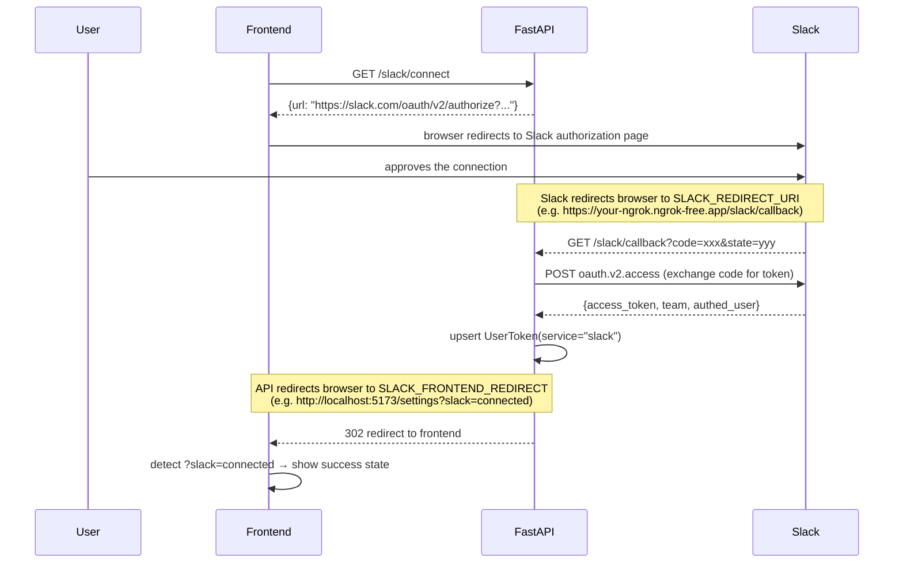

# Slack Integration API

Allows users to connect their Slack workspace via OAuth. Once connected, their Slack access token is stored securely and can be used by the pipeline to send messages as actions.

**Base URL (local):** `http://localhost:8000`  
**Interactive docs:** `http://localhost:8000/docs`

---

## Endpoints

| Method | Path | Auth required | Description |
|--------|------|:---:|-------------|
| `GET` | `/slack/connect` | Yes | Get the Slack OAuth authorization URL to redirect the user to |
| `GET` | `/slack/callback` | No | Slack redirects here after the user approves — exchanges code for token and stores it |
| `GET` | `/slack/status` | Yes | Check whether the current user has connected Slack |
| `DELETE` | `/slack/disconnect` | Yes | Remove the user's stored Slack token |

All protected routes accept the JWT via **`Authorization: Bearer <token>`**.

---

## OAuth Flow

```
1. Frontend calls GET /slack/connect → gets a URL
2. Frontend redirects the user to that URL (Slack's authorization page)
3. User approves → Slack redirects to GET /slack/callback (your backend)
4. Backend exchanges the code for a token, stores it, redirects user to SLACK_FRONTEND_REDIRECT
5. Frontend detects ?slack=connected and shows a success state
```



---

## GET /slack/connect

Returns the Slack OAuth authorization URL. The frontend should redirect the user (or open a popup) to this URL.

### Request

**Authentication:** required. Send JWT via `Authorization: Bearer <token>`.

No request body or query parameters.

### Response

**Status:** `200 OK`

```json
{
  "url": "https://slack.com/oauth/v2/authorize?client_id=...&scope=chat:write,...&redirect_uri=...&state=..."
}
```

### Example (fetch)

```js
const res = await fetch('http://localhost:8000/slack/connect', {
  headers: { Authorization: `Bearer ${jwt}` },
});
const { url } = await res.json();
window.location.href = url;   // or open in a popup
```

---

## GET /slack/callback

> **Note:** This endpoint is called by Slack directly — not by your frontend code. You only need to be aware of it so you can handle the redirect it sends back to your frontend.

Slack sends the browser here after the user approves the connection. The API:

1. Validates the `state` parameter to identify the user.
2. Exchanges the `code` for an access token via Slack's `oauth.v2.access` API.
3. Saves the token to the database (`UserToken` with `service="slack"`).
4. Redirects the browser to `SLACK_FRONTEND_REDIRECT` (configured on the server, e.g. `http://localhost:5173/settings?slack=connected`).

### Query Parameters (sent by Slack)

| Parameter | Description |
|-----------|-------------|
| `code` | Temporary authorization code from Slack |
| `state` | Opaque state token issued by `/slack/connect` |

### Frontend handling

After the redirect, detect the result from the URL query string:

```js
// e.g. on /settings page mount
const params = new URLSearchParams(window.location.search);

if (params.get('slack') === 'connected') {
  // show success toast / refresh status
}
```

### Error responses

| Status | When |
|--------|------|
| `400` | Invalid `state` parameter or Slack returned an OAuth error (e.g. user cancelled) |
| `502` | Could not reach Slack's token endpoint |
| `503` | `SLACK_CLIENT_ID` / `SLACK_CLIENT_SECRET` not configured on the server |

---

## GET /slack/status

Check whether the current user has a connected Slack workspace.

### Request

**Authentication:** required. Send JWT via `Authorization: Bearer <token>`.

### Response

**Status:** `200 OK`

```json
{
  "connected": true,
  "workspace": "Acme Corp",
  "slack_user_id": "U012AB3CD"
}
```

| Field | Type | Description |
|-------|------|-------------|
| `connected` | boolean | `true` if a Slack token exists for this user |
| `workspace` | string \| null | Name of the connected Slack workspace, or `null` if not connected |
| `slack_user_id` | string \| null | The Slack user ID of the person who authorised the connection |

### Example (fetch)

```js
const res = await fetch('http://localhost:8000/slack/status', {
  headers: { Authorization: `Bearer ${jwt}` },
});
const status = await res.json();

if (status.connected) {
  console.log(`Connected to "${status.workspace}"`);
} else {
  console.log('Not connected');
}
```

---

## DELETE /slack/disconnect

Remove the user's stored Slack token. Idempotent — returns `204` whether or not a token existed.

### Request

**Authentication:** required. Send JWT via `Authorization: Bearer <token>`.

No request body.

### Response

**Status:** `204 No Content`

### Example (fetch)

```js
await fetch('http://localhost:8000/slack/disconnect', {
  method: 'DELETE',
  headers: { Authorization: `Bearer ${jwt}` },
});
// Token removed — update UI to show disconnected state
```

---

## Suggested UI Flow (Settings Page)

```
┌─────────────────────────────────────────┐
│  Integrations                           │
│                                         │
│  Slack                                  │
│  ┌─────────────────────────────────┐    │
│  │ ● Connected — Acme Corp        │    │
│  │ Connected as U012AB3CD          │    │
│  │                    [Disconnect] │    │
│  └─────────────────────────────────┘    │
│                                         │
│  — or when not connected —              │
│  ┌─────────────────────────────────┐    │
│  │  Slack not connected            │    │
│  │                  [Connect Slack]│    │
│  └─────────────────────────────────┘    │
└─────────────────────────────────────────┘
```

1. On page load, call `GET /slack/status` to check connection state.
2. **Connect button** → call `GET /slack/connect`, redirect user to the returned URL.
3. On return (`?slack=connected` in URL), re-fetch status and show success.
4. **Disconnect button** → call `DELETE /slack/disconnect`, re-fetch status.

---

## Error Reference

| Status | Meaning |
|--------|---------|
| `204` | Success (disconnect) |
| `302` | Callback redirect to frontend (normal OAuth completion) |
| `400` | Bad request — invalid state or Slack OAuth error |
| `401` | Missing or invalid JWT |
| `502` | Could not reach Slack's API |
| `503` | Slack OAuth not configured on the server (missing env vars) |
