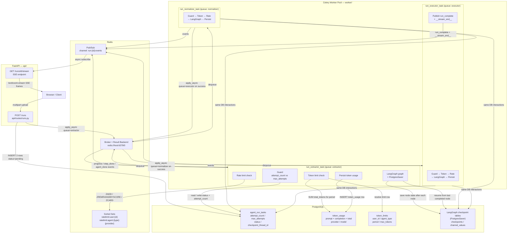
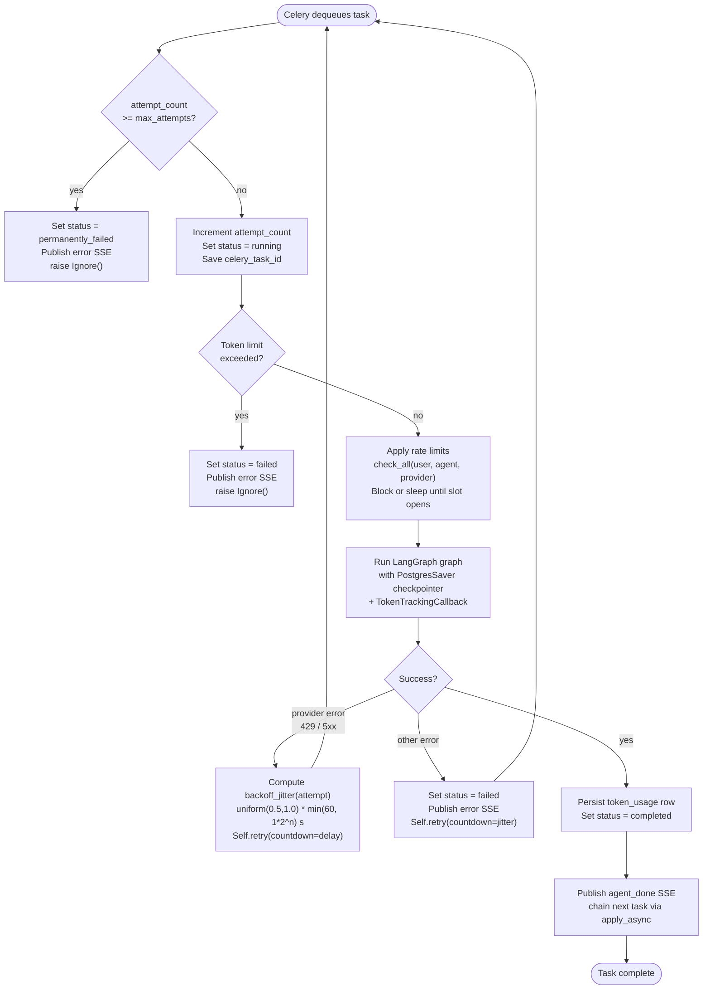
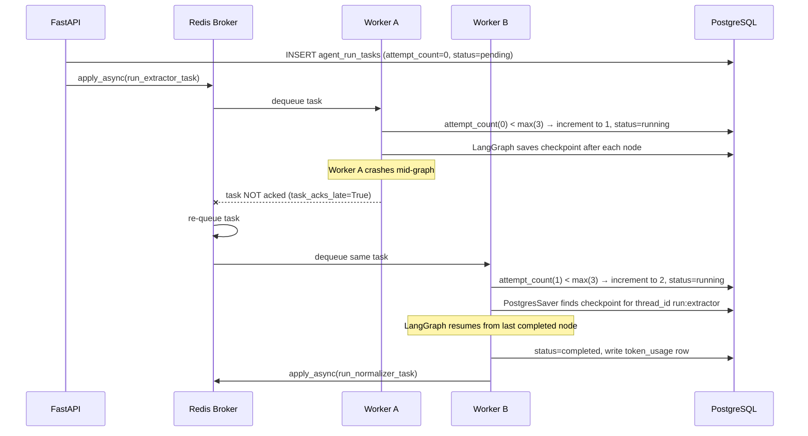

# Worker — Fault-Tolerant Agent Execution

This document covers everything added to make the three LangGraph agents
(extractor → normalizer → executor) resilient, observable, and safe to run
at scale. All new code lives in the `worker/` package.

---

## Table of Contents

1. [Architecture Overview](#architecture-overview)
   - [System Topology](#system-topology)
   - [Per-Task Lifecycle](#per-task-lifecycle)
   - [Retry and Checkpoint Resume Flow](#retry-and-checkpoint-resume-flow)
2. [Celery + Redis Setup](#celery--redis-setup)
3. [LangGraph Postgres Checkpointer](#langgraph-postgres-checkpointer)
4. [Fault Tolerance & Retry Guard](#fault-tolerance--retry-guard)
5. [Token Usage Tracking](#token-usage-tracking)
6. [Token Hard Limits](#token-hard-limits)
7. [Rate Limiting](#rate-limiting)
8. [Exponential Backoff with Jitter](#exponential-backoff-with-jitter)
9. [SSE Event Streaming via Redis Pub/Sub](#sse-event-streaming-via-redis-pubsub)
10. [Database Schema Changes](#database-schema-changes)
11. [Environment Variables](#environment-variables)
12. [Running Locally](#running-locally)
13. [File Reference](#file-reference)

---

## Architecture Overview

### System Topology

The diagram below shows every component and how they are connected at runtime.



---

### Per-Task Lifecycle

Every agent task (extractor, normalizer, executor) follows this internal
sequence. The same steps run for all three — only the LangGraph graph and
output differ.



---

### Retry and Checkpoint Resume Flow



---

Tasks are chained explicitly (not via Celery `chain()`): each task calls
`next_task.apply_async(...)` on success, so the chain is visible in the DB
and is naturally broken if a step reaches `permanently_failed`.

---

## Celery + Redis Setup

**File:** `worker/celery_app.py`

```python
celery_app = Celery("agent_worker", broker=REDIS_URL, backend=REDIS_URL)
```

### Queues

| Queue | Task |
|---|---|
| `extractor` | `worker.tasks.run_extractor_task` |
| `normalizer` | `worker.tasks.run_normalizer_task` |
| `executor` | `worker.tasks.run_executor_task` |

Each queue maps to a single task type. Workers can be scaled per queue
independently (e.g. spin up more normalizer workers for heavy workloads).

### Key Settings

| Setting | Value | Why |
|---|---|---|
| `task_acks_late` | `True` | Task is only acknowledged **after** it finishes. If the worker dies mid-run, the broker re-queues the task for another worker. |
| `task_reject_on_worker_lost` | `True` | Complements `task_acks_late` — rejects instead of acking if the worker connection drops. |
| `worker_prefetch_multiplier` | `1` | Each worker slot takes one task at a time, preventing long tasks from blocking short ones. |
| `result_expires` | `86400` | Celery results kept for 24 hours so the API can inspect them. |

### Starting Workers

```bash
# All three queues on one worker process (4 concurrent slots)
celery -A worker.celery_app worker --concurrency=4 -Q extractor,normalizer,executor --loglevel=info

# Or separate processes per queue for independent scaling
celery -A worker.celery_app worker --concurrency=2 -Q extractor  --loglevel=info
celery -A worker.celery_app worker --concurrency=2 -Q normalizer --loglevel=info
celery -A worker.celery_app worker --concurrency=2 -Q executor   --loglevel=info
```

---

## LangGraph Postgres Checkpointer

**File:** `worker/checkpointer.py`

LangGraph's `PostgresSaver` (from `langgraph-checkpoint-postgres`) persists
the full graph state after every node completes. If a worker crashes
mid-graph, the next worker that picks up the Celery task resumes from the
last successfully completed node — not from the beginning.

### Thread ID Convention

Every run + agent combination gets a **stable** thread ID:

```
{run_id}:{agent_type}
# e.g. "a3f9c1d2:extractor"
```

This ID never changes across retries, so LangGraph always finds the same
checkpoint and resumes from it.

### Usage

```python
from worker.checkpointer import build_checkpointer, make_thread_id

thread_id = make_thread_id(run_id, "extractor")

with build_checkpointer() as checkpointer:
    app = graph.compile(checkpointer=checkpointer)
    config = {"configurable": {"thread_id": thread_id}}
    result = app.invoke(initial_state, config=config)
```

`build_checkpointer()` is a context manager that:
1. Opens a synchronous `psycopg` connection to `SYNC_DATABASE_URL`.
2. Calls `PostgresSaver.setup()` (idempotent — creates checkpoint tables only
   if they do not exist).
3. Yields the ready `PostgresSaver` instance.
4. Closes the connection when the `with` block exits.

> **Why sync?** Celery workers run in plain threads, not an async event loop.
> `asyncpg` / async SQLAlchemy cannot be used here. `psycopg` (v3 sync) is
> the correct driver for this context.

### Workflow Changes

Each of the three workflow files now accepts an optional `checkpointer`
parameter:

```python
# src/action_extractor/workflow.py
def create_action_extraction_graph(checkpointer=None):
    ...
    app = workflow.compile(checkpointer=checkpointer) if checkpointer else workflow.compile()

# New entry point used by Celery tasks
def extract_actions_with_progress_checkpointed(
    transcript_raw, progress_callback, *,
    checkpointer=None, thread_id=None, callbacks=None,
) -> list: ...
```

Identical `*_with_progress_checkpointed()` variants exist for the normalizer
(`normalize_actions_with_progress_checkpointed`) and executor
(`execute_actions_with_progress_checkpointed`). The existing
`*_with_progress()` functions are untouched and still used by the legacy
synchronous path.

---

## Fault Tolerance & Retry Guard

**File:** `worker/tasks.py`  
**DB Model:** `api/models.py` → `AgentRunTask`

### The Problem

Celery's built-in `max_retries` is per-task-instance — it resets to 0 when a
new worker picks up the task. Without a cross-worker counter, a step could be
retried indefinitely if workers keep crashing.

### The Solution: `AgentRunTask` table

```
agent_run_tasks
  run_id              — identifies the pipeline run
  agent_type          — extractor | normalizer | executor
  celery_task_id      — current Celery task ID (updated each attempt)
  checkpoint_thread_id — stable "{run_id}:{agent_type}" for PostgresSaver
  status              — pending | running | completed | failed | permanently_failed
  attempt_count       — incremented by every worker that picks up this step
  max_attempts        — hard ceiling (default: CELERY_MAX_RETRIES = 3)
  error_message       — last error (truncated to 2000 chars)
```

### Retry Lifecycle

See the [Retry and Checkpoint Resume Flow](#retry-and-checkpoint-resume-flow)
sequence diagram in the Architecture Overview for the full step-by-step crash
and resume walkthrough.

At the code level, `_task_start()` in `worker/tasks.py` is called at the very
top of every task. It:

1. Loads the `AgentRunTask` row for this `run_id` + `agent_type`.
2. If `status == "permanently_failed"` — raises `Ignore()` immediately (silent no-op).
3. If `attempt_count >= max_attempts` — sets `status = permanently_failed`, publishes
   an SSE error event with `code: "max_attempts_reached"`, raises `Ignore()`.
4. Otherwise — increments `attempt_count`, sets `status = running`, saves the new
   `celery_task_id`, and returns the row so the rest of the task can proceed.

---

## Token Usage Tracking

**File:** `worker/token_tracker.py`  
**DB Model:** `api/models.py` → `TokenUsage`

### TokenTrackingCallback

A `langchain_core.callbacks.BaseCallbackHandler` subclass attached to every
LangGraph run via `config={"callbacks": [callback]}`.

It intercepts `on_llm_end(response: LLMResult)` and accumulates:
- `prompt_tokens`
- `completion_tokens`
- `total_tokens`

Provider normalisation is handled automatically — the callback reads from
multiple possible response fields to cover all supported providers:

| Provider | Token field |
|---|---|
| OpenAI | `llm_output["token_usage"]` |
| Anthropic | `llm_output["usage"]` → `input_tokens` / `output_tokens` |
| Google Gemini | `generation_info["prompt_token_count"]` / `candidates_token_count` |
| LangChain ≥0.2 | `message.usage_metadata.input_tokens` / `output_tokens` |

```python
cb = TokenTrackingCallback(run_id=run_id, agent_type="extractor", provider="gemini_mixed")
# attach to graph invocation:
app.invoke(state, config={"configurable": {"thread_id": tid}, "callbacks": [cb]})

print(cb.prompt_tokens)      # total input tokens across all nodes
print(cb.completion_tokens)  # total output tokens
print(cb.total_tokens)       # sum
```

### Persistence

After each agent completes successfully, `persist_token_usage(db, callback, user_id)`
writes one `token_usage` row:

```
token_usage
  user_id          — FK → users
  run_id           — the pipeline run ID
  agent_type       — extractor | normalizer | executor
  provider         — e.g. gemini_mixed, claude, openai
  model            — specific model name (captured from response metadata)
  prompt_tokens
  completion_tokens
  total_tokens
  created_at
```

---

## Token Hard Limits

**File:** `worker/token_tracker.py` → `check_token_limit()`  
**DB Model:** `api/models.py` → `TokenLimit`

### How Limits Are Stored

```
token_limits
  user_id    — NULL means "global default for all users"
  agent_type — NULL means "limit applies to all agents combined"
  period     — daily | monthly
  max_tokens — 0 means unlimited
```

### Specificity Priority

When looking up the limit for a given user + agent, the most specific row
wins:

| Priority | user_id | agent_type |
|---|---|---|
| 1 (highest) | set | set |
| 2 | set | NULL |
| 3 | NULL | set |
| 4 (lowest) | NULL | NULL |

If no DB row matches, the check falls back to env-var defaults
(`TOKEN_LIMIT_DAILY_DEFAULT`, `TOKEN_LIMIT_MONTHLY_DEFAULT`). A value of `0`
means unlimited.

### Enforcement

`check_token_limit(user_id, agent_type, db)` is called at the **start** of
each agent task before any LLM calls are made. It sums all `token_usage.total_tokens`
for the user in the current period and raises `TokenLimitExceeded` if the
accumulated total already meets or exceeds the limit.

```python
# Example: set a 100,000 daily token limit for a specific user
TokenLimit(user_id=user_id, agent_type=None, period="daily", max_tokens=100_000)

# Example: set a global 50,000 daily limit for the normalizer only
TokenLimit(user_id=None, agent_type="normalizer", period="daily", max_tokens=50_000)
```

When the limit is exceeded the task raises `Ignore()` (no retry) and
publishes an SSE error event with `code: "token_limit_exceeded"`.

---

## Rate Limiting

**File:** `worker/rate_limiter.py`

Two independent sliding-window rate limiters prevent API bans from upstream
LLM providers.

### Redis Keys

| Scope | Redis Key |
|---|---|
| Per-user | `ratelimit:user:{user_id}` |
| Per-agent + provider | `ratelimit:agent:{agent_type}:{provider}` |

### Algorithm (Sorted Set Sliding Window)

Each call to `_check(key, limit, window)` executes atomically via a Redis
pipeline:

```
ZREMRANGEBYSCORE key -inf (now - window)   # remove expired entries
ZCARD key                                   # count current calls in window
ZADD key {uuid: now}                        # record this call
EXPIRE key (window + 10)                    # auto-cleanup grace period
```

If `current_count >= limit` the new entry is removed and:
- **`block=True`** (default): sleep until the oldest entry expires, then
  retry. This is used for short bursts where the worker should just wait
  rather than fail.
- **`block=False`**: raise `RateLimitExceeded` immediately.

### Defaults (configurable via env)

| Limit | Default | Env Var |
|---|---|---|
| Per-user / minute | 60 | `RATE_LIMIT_USER_PER_MINUTE` |
| Per-agent+provider / minute | 30 | `RATE_LIMIT_AGENT_PER_MINUTE` |

Set to `0` to disable a limit entirely.

### Usage in Tasks

```python
from worker.rate_limiter import get_rate_limiter

get_rate_limiter().check_all(user_id, agent_type, provider)
# Internally calls check_user() then check_agent()
```

---

## Exponential Backoff with Jitter

**File:** `worker/rate_limiter.py` → `backoff_jitter()`

Used when a provider returns a transient error (HTTP 429, 500, 502, 503, 504
or known exception class names like `RateLimitError`, `APITimeoutError`,
`ServiceUnavailableError`, etc.).

### Formula

```
delay = uniform(0.5, 1.0) * min(cap, base * 2^attempt)
```

| Parameter | Default |
|---|---|
| `base` | 1.0 s |
| `cap` | 60.0 s |

| Attempt | Max ceiling | Typical range |
|---|---|---|
| 1 | 2 s | 1 – 2 s |
| 2 | 4 s | 2 – 4 s |
| 3 | 8 s | 4 – 8 s |
| 4 | 16 s | 8 – 16 s |
| 5+ | 60 s | 30 – 60 s |

The **full-jitter** variant (multiplied by `uniform(0.5, 1.0)` rather than
a fixed factor) avoids thundering-herd retries when many workers hit the
same provider limit simultaneously. Each worker wakes up at a slightly
different time, spreading the load.

### Provider Error Detection

```python
_PROVIDER_ERROR_NAMES = frozenset({
    "RateLimitError", "APIStatusError", "InternalServerError",
    "ServiceUnavailableError", "APIConnectionError", "APITimeoutError",
    "TooManyRequestsError",
})

def _is_provider_error(exc) -> bool:
    return (type(exc).__name__ in _PROVIDER_ERROR_NAMES
            or getattr(exc, "status_code", 0) in (429, 500, 502, 503, 504))
```

When `_is_provider_error` returns `True`, the task sleeps for `backoff_jitter(attempt)`
seconds then re-raises the exception so Celery issues `self.retry(countdown=delay)`.

---

## SSE Event Streaming via Redis Pub/Sub

The original SSE implementation used an `asyncio.Queue` held in process
memory (`_runs` dict in `api/routes/runs.py`). This meant the API process
had to be the one running the pipeline — it could not survive a restart or
scale to multiple API instances.

The new implementation decouples the pipeline (Celery workers) from the
stream consumer (FastAPI):

```
Celery worker                         FastAPI
─────────────────────────────────     ──────────────────────────────────
_publish_event(run_id, "progress",    GET /runs/{id}/stream
  {"agent": "extractor", ...})     →  subscribe to run:{run_id}:events
  │                                   │
  └─ r.publish("run:{id}:events",     └─ async for msg in pubsub.listen()
       json.dumps(...))                     yield _sse_message(event, data)
```

### Published Events

| Event Type | When Published | Data Fields |
|---|---|---|
| `progress` | Start of each agent step | `agent`, `step`, `status: "running"` |
| `step_done` | After each LangGraph node | `agent`, `step` |
| `agent_done` | After each agent completes | `agent` |
| `error` | On task failure / limit exceeded | `agent`, `message`, `code?`, `step?` |
| `run_complete` | After executor succeeds | `summary`, `executor_actions` |
| `__stream_end__` | Internal — closes SSE stream | _(not forwarded to client)_ |

### Stream Termination

The SSE generator (`api/routes/runs.py`) closes when it receives:
- `__stream_end__` — normal completion
- `run_complete` — same, after forwarding the final event
- 5-minute deadline exceeded — timeout guard

---

## Database Schema Changes

Three new tables are created automatically by `Base.metadata.create_all`
on API startup.

### `agent_run_tasks`

Tracks each agent step's retry state across all workers.

| Column | Type | Description |
|---|---|---|
| `id` | UUID PK | |
| `run_id` | String(128) | Matches `run_request_logs.run_id` |
| `user_id` | UUID FK→users | Nullable |
| `agent_type` | String(32) | `extractor` / `normalizer` / `executor` |
| `celery_task_id` | String(255) | Current Celery task ID (updated each attempt) |
| `checkpoint_thread_id` | String(255) | `{run_id}:{agent_type}` — stable across retries |
| `status` | String(32) | `pending` / `running` / `completed` / `failed` / `permanently_failed` |
| `attempt_count` | Integer | Incremented by every worker that starts the task |
| `max_attempts` | Integer | Hard ceiling (default: `CELERY_MAX_RETRIES`) |
| `error_message` | Text | Last error message (truncated to 2,000 chars) |
| `created_at` / `updated_at` | DateTime(TZ) | |

Unique constraint: `(run_id, agent_type)`.

### `token_usage`

One row per agent per run, written after successful completion.

| Column | Type | Description |
|---|---|---|
| `id` | UUID PK | |
| `user_id` | UUID FK→users | Nullable |
| `run_id` | String(128) | |
| `agent_type` | String(32) | `extractor` / `normalizer` / `executor` |
| `provider` | String(64) | e.g. `gemini_mixed`, `claude` |
| `model` | String(128) | Specific model name from response metadata |
| `prompt_tokens` | Integer | |
| `completion_tokens` | Integer | |
| `total_tokens` | Integer | |
| `created_at` | DateTime(TZ) | |

### `token_limits`

Configures hard token budgets. Insert rows directly via SQL or an admin API.

| Column | Type | Description |
|---|---|---|
| `id` | UUID PK | |
| `user_id` | UUID FK→users | `NULL` = global default |
| `agent_type` | String(32) | `NULL` = applies to all agents |
| `period` | String(16) | `daily` or `monthly` |
| `max_tokens` | Integer | `0` = unlimited |
| `created_at` / `updated_at` | DateTime(TZ) | |

---

## Environment Variables

Add these to your `.env` (see `.env.example` for the full list):

| Variable | Default | Description |
|---|---|---|
| `REDIS_URL` | `redis://localhost:6379/0` | Redis connection string (broker, backend, rate limiter, pub/sub) |
| `SYNC_DATABASE_URL` | `postgresql://...` | Sync psycopg2 URL for Celery workers (no `+asyncpg`) |
| `CELERY_MAX_RETRIES` | `3` | Max times any agent step can be attempted across all workers |
| `TOKEN_LIMIT_DAILY_DEFAULT` | `0` | Global daily token limit (0 = unlimited) |
| `TOKEN_LIMIT_MONTHLY_DEFAULT` | `0` | Global monthly token limit (0 = unlimited) |
| `RATE_LIMIT_USER_PER_MINUTE` | `60` | Per-user LLM call limit per minute (0 = unlimited) |
| `RATE_LIMIT_AGENT_PER_MINUTE` | `30` | Per-agent+provider call limit per minute (0 = unlimited) |

---

## Running Locally

### Prerequisites

- PostgreSQL running (see `docker-compose.yml`)
- Redis running:
  ```bash
  docker compose up redis -d
  # or standalone:
  docker run -p 6379:6379 redis:7-alpine
  ```

### Install dependencies

```bash
pip install -r requirements.txt
```

### Start everything with Docker Compose

```bash
docker compose up --build
```

This starts `postgres`, `redis`, `api` (FastAPI on :8000), and `worker`
(Celery) in one command.

### Start services manually

```bash
# Terminal 1 — API
python run_api.py

# Terminal 2 — Celery worker (all queues)
celery -A worker.celery_app worker --concurrency=4 \
       -Q extractor,normalizer,executor --loglevel=info
```

### Monitoring with Flower (optional)

```bash
pip install flower
celery -A worker.celery_app flower --port=5555
# Open http://localhost:5555
```

---

## File Reference

| File | Purpose |
|---|---|
| `worker/__init__.py` | Package marker |
| `worker/celery_app.py` | Celery app, Redis broker/backend, queue routing |
| `worker/checkpointer.py` | `build_checkpointer()` context manager, `make_thread_id()` |
| `worker/rate_limiter.py` | `RedisRateLimiter`, `backoff_jitter()`, `RateLimitExceeded` |
| `worker/token_tracker.py` | `TokenTrackingCallback`, `check_token_limit()`, `persist_token_usage()` |
| `worker/tasks.py` | `run_extractor_task`, `run_normalizer_task`, `run_executor_task` |
| `api/models.py` | `AgentRunTask`, `TokenUsage`, `TokenLimit` ORM models |
| `api/db.py` | `sync_session_factory`, `get_sync_db()` for Celery workers |
| `api/routes/runs.py` | Celery dispatch in `POST /runs`, Redis PubSub SSE in `GET /runs/{id}/stream` |
| `src/action_extractor/workflow.py` | `create_action_extraction_graph(checkpointer)`, `extract_actions_with_progress_checkpointed()` |
| `src/action_normalizer/workflow.py` | `create_normalizer_graph(checkpointer)`, `normalize_actions_with_progress_checkpointed()` |
| `src/action_executor/workflow.py` | `build_executor_graph(checkpointer)`, `execute_actions_with_progress_checkpointed()` |
| `docker-compose.yml` | Added `redis` and `worker` services |
| `requirements.txt` | Added `celery[redis]`, `redis`, `langgraph-checkpoint-postgres`, `psycopg[binary]`, `psycopg2-binary` |
| `.env.example` | Added all new env vars with documentation |
